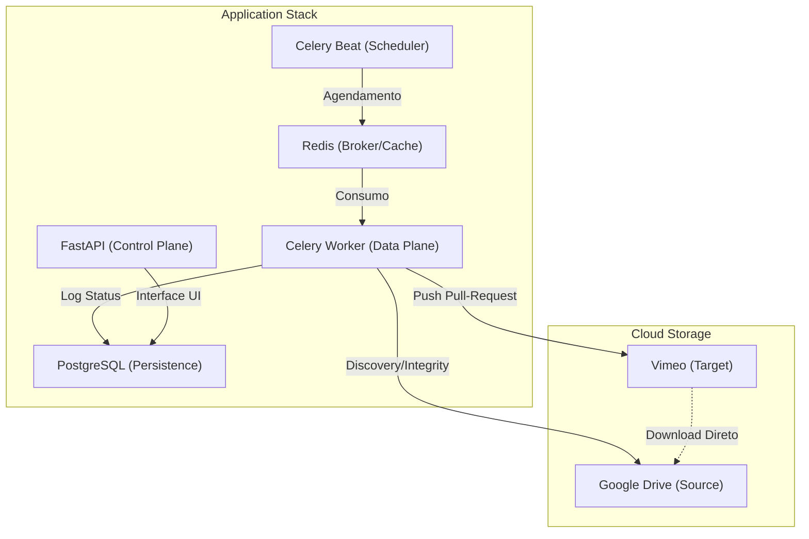

# 🎬 Drive → Vimeo Sync

[](https://fastapi.tiangolo.com/)
[](https://docs.celeryq.dev/)
[](https://www.docker.com/)
[](https://www.postgresql.org/)

Sistema de sincronização automática de vídeos do **Google Drive para o Vimeo**, projetado para alta eficiência e zero consumo de banda local. Utiliza a abordagem **Pull Upload**, onde os servidores do Vimeo baixam o conteúdo diretamente dos servidores do Google, garantindo que os arquivos nunca transitem pela VPS.

---

## ✨ Características

- 🚀 **Pull Approach**: Transferência direta Cloud-to-Cloud.
- 📂 **Espelhamento de Estrutura**: Mantém a hierarquia de pastas do Drive no Vimeo.
- 🛡️ **Integridade Garantida**: Verificação de estabilidade MD5 proporcional ao tamanho do arquivo.
- 📊 **Dashboard Premium**: Interface moderna com Dark Mode, monitoramento em tempo real e relatórios.
- 🔐 **RBAC & Segurança**: Controle de acesso baseado em roles (Admin/Auditor) com JWT.
- 🔄 **Auto-Retry**: Mecanismo de recuperação automática de falhas com logs detalhados.

---

## 🏗️ Arquitetura

O sistema é composto por uma stack robusta baseada em micro-serviços:



---

## 🚀 Como Iniciar

### 📋 Pré-requisitos

- Docker & Docker Compose
- Google Service Account (JSON Key) com acesso à pasta do Drive
- Vimeo Access Token (com escopos `public`, `private`, `video_files`, `edit`, `upload`)

### 🛠️ Configuração

1.  **Clone o repositório**:
    ```bash
    git clone https://github.com/tioros/automate-sync-vimeo-drive-NAS.git
    cd automate-sync-vimeo-drive-NAS
    ```

2.  **Variáveis de Ambiente**:
    Copie o arquivo `.env.example` para `.env` e preencha as credenciais.
    ```bash
    cp .env.example .env
    ```

3.  **Service Account**:
    Coloque o seu arquivo JSON da Service Account na pasta `keys/` (ou conforme configurado no `.env`).

4.  **Inicie a Stack**:
    ```bash
    docker-compose up -d --build
    ```

5.  **Migrações e Usuários**:
    ```bash
    docker-compose exec api alembic upgrade head
    docker-compose exec api python -m scripts.create_users
    ```

---

## 🖥️ Dashboard

Acesse `http://localhost:8000` e faça login com as credenciais padrão criadas pelo script de seed:
- **Admin**: `admin@drivevimeo.local` / `admin123`
- **Auditor**: `auditor@drivevimeo.local` / `auditor123`

---

## 📂 Estrutura do Projeto

- `/app`: Código fonte da API FastAPI, modelos e serviços.
- `/worker`: Configuração do Celery e lógica das tarefas em background.
- `/docs`: Documentação técnica e especificações.
- `/migrations`: Migrações do banco de dados via Alembic.
- `/scripts`: Scripts de utilidade (seed, backup, etc).

---

## 📄 Licença

Distribuído sob a licença MIT. Veja `LICENSE` para mais informações.

---
Developed with ❤️ by [Antigravity AI](https://github.com/google-deepmind/antigravity)
